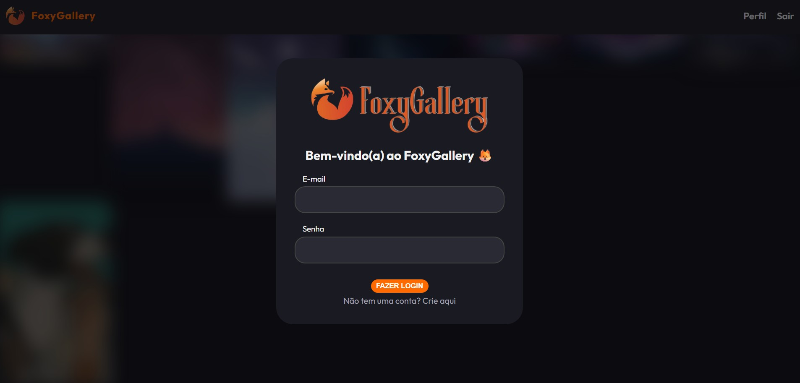
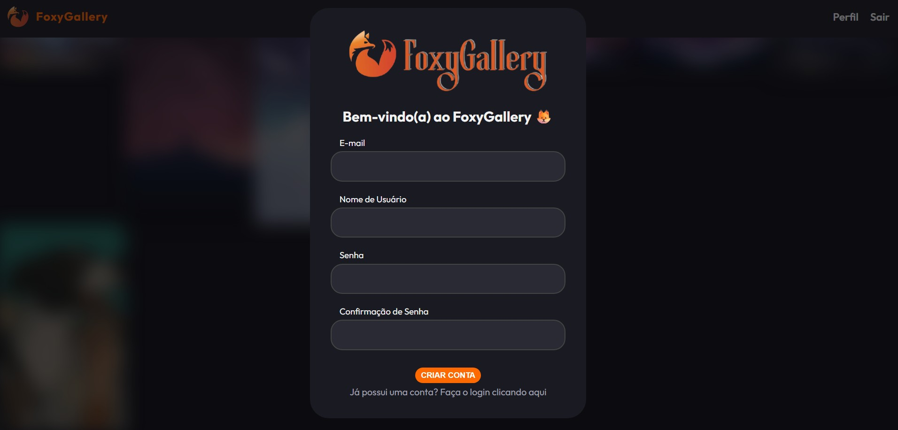
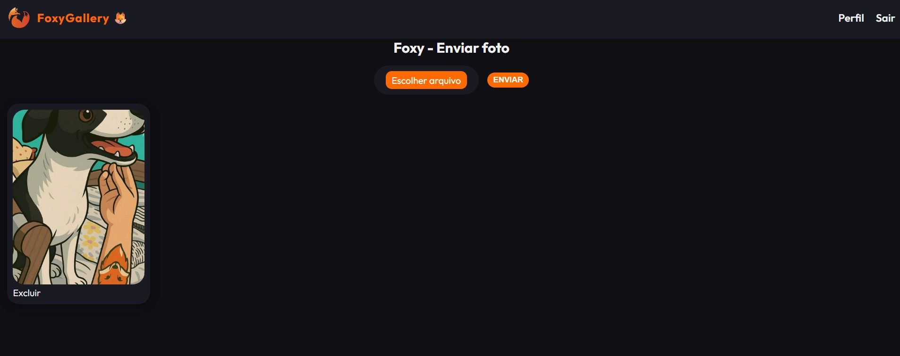
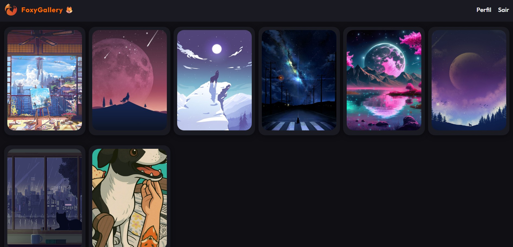

# 🦊 FoxyGallery

Uma aplicação web inspirada no Pinterest desenvolvida com Flask, permitindo cadastro de usuários, login, upload de imagens e visualização de perfis.

---

## ✨ Funcionalidades

- Cadastro de usuários
- Sistema de login e logout
- Upload de imagens
- Exclusão de imagens pelo próprio usuário
- Feed com publicações
- Perfil de usuário
- Visualização de imagens em nova aba
- Banco de dados com SQLite
- Interface personalizada com HTML e CSS

---

## 🛠️ Tecnologias utilizadas

- Python
- Flask
- Flask-Login
- Flask-WTF
- SQLAlchemy
- SQLite
- HTML5
- CSS3
- Git e GitHub

---

## 📷 Imagens do projeto

### Homepage/Login



### Criar Conta



### Perfil



### Feed



## 🚀 Como executar o projeto

### 1. Clone o repositório

```bash
git clone https://github.com/JessyGodoy/FoxyGallery.git
```

### 2. Entre na pasta do projeto

```bash
cd FoxyGallery
```

### 3. Crie um ambiente virtual

```bash
python -m venv venv
```

### 4. Ative o ambiente virtual

#### Windows

```bash
venv\Scripts\activate
```

---

### 5. Instale as dependências

```bash
pip install -r requirements.txt
```

---

### 6. Execute o projeto

```bash
python main.py
```

Depois, abra no navegador:

```text
http://127.0.0.1:5000
```

---

## 📚 Aprendizados

Durante o desenvolvimento do projeto, foram praticados conceitos como:

- Estruturação de aplicações Flask
- Rotas e templates
- Upload de arquivos
- Relacionamento entre tabelas
- Autenticação de usuários
- Criptografia e segurança de senhas com Bcrypt
- Proteção de formulários com CSRF Token
- Organização de projeto web
- Versionamento com Git e GitHub
- Estilização com CSS

---

## 👩‍💻 Desenvolvido por

Jéssica Godoy

GitHub:

https://github.com/JessyGodoy
